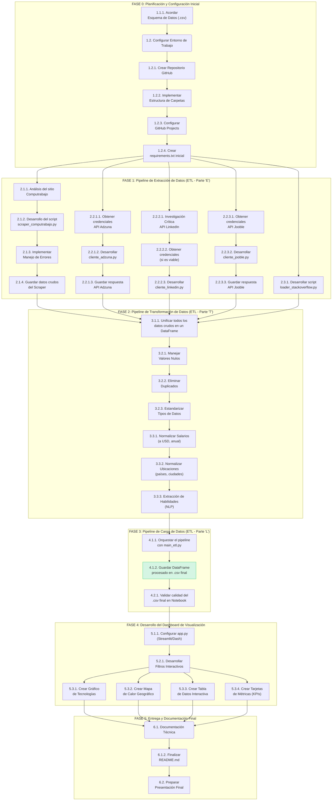

```mermaid
  graph TD
    subgraph "FASE 0: Planificación y Configuración Inicial"
        F0_1["1.1.1. Acordar<br>Esquema de Datos (.csv)"] --> F0_2("1.2. Configurar Entorno de Trabajo");
        F0_2 --> F0_3["1.2.1. Crear Repositorio GitHub"];
        F0_3 --> F0_4["1.2.2. Implementar<br>Estructura de Carpetas"];
        F0_4 --> F0_5["1.2.3. Configurar<br>GitHub Projects"];
        F0_5 --> F0_6["1.2.4. Crear<br>requirements.txt inicial"];
    end

    subgraph "FASE 1: Pipeline de Extracción de Datos (ETL - Parte 'E')"
        F0_6 --> F1_WS_1["2.1.1. Análisis del sitio<br>Computrabajo"];
        F1_WS_1 --> F1_WS_2["2.1.2. Desarrollo del script<br>scraper_computrabajo.py"];
        F1_WS_2 --> F1_WS_3["2.1.3. Implementar<br>Manejo de Errores"];
        F1_WS_3 --> F1_WS_4["2.1.4. Guardar datos crudos<br>del Scraper"];

        F0_6 --> F1_API_A1["2.2.1.1. Obtener credenciales<br>API Adzuna"];
        F1_API_A1 --> F1_API_A2["2.2.1.2. Desarrollar<br>cliente_adzuna.py"];
        F1_API_A2 --> F1_API_A3["2.2.1.3. Guardar respuesta<br>API Adzuna"];

        F0_6 --> F1_API_L1["2.2.2.1. Investigación Crítica<br>API LinkedIn"];
        F1_API_L1 --> F1_API_L2["2.2.2.2. Obtener credenciales<br>(si es viable)"];
        F1_API_L2 --> F1_API_L3["2.2.2.3. Desarrollar<br>cliente_linkedin.py"];

        F0_6 --> F1_API_J1["2.2.3.1. Obtener credenciales<br>API Jooble"];
        F1_API_J1 --> F1_API_J2["2.2.3.2. Desarrollar<br>cliente_jooble.py"];
        F1_API_J2 --> F1_API_J3["2.2.3.3. Guardar respuesta<br>API Jooble"];

        F0_6 --> F1_CSV["2.3.1. Desarrollar script<br>loader_stackoverflow.py"];
    end

    subgraph "FASE 2: Pipeline de Transformación de Datos (ETL - Parte 'T')"
        F1_WS_4 --> F2_U["3.1.1. Unificar todos los<br>datos crudos en un DataFrame"];
        F1_API_A3 --> F2_U;
        F1_API_L3 --> F2_U;
        F1_API_J3 --> F2_U;
        F1_CSV --> F2_U;

        F2_U --> F2_C1["3.2.1. Manejar<br>Valores Nulos"];
        F2_C1 --> F2_C2["3.2.2. Eliminar<br>Duplicados"];
        F2_C2 --> F2_C3["3.2.3. Estandarizar<br>Tipos de Datos"];

        F2_C3 --> F2_N1["3.3.1. Normalizar Salarios<br>(a USD, anual)"];
        F2_N1 --> F2_N2["3.3.2. Normalizar Ubicaciones<br>(países, ciudades)"];
        F2_N2 --> F2_N3["3.3.3. Extracción de Habilidades<br>(NLP)"];
    end

    subgraph "FASE 3: Pipeline de Carga de Datos (ETL - Parte 'L')"
        F2_N3 --> F3_G["4.1.1. Orquestar el pipeline<br>con main_etl.py"];
        F3_G --> F3_S["4.1.2. Guardar DataFrame<br>procesado en .csv final"];
        F3_S --> F3_V["4.2.1. Validar calidad del<br>.csv final en Notebook"];
    end
    
    subgraph "FASE 4: Desarrollo del Dashboard de Visualización"
        F3_V --> F4_C["5.1.1. Configurar app.py<br>(Streamlit/Dash)"];
        F4_C --> F4_UI["5.2.1. Desarrollar<br>Filtros Interactivos"];
        F4_UI --> F4_V1["5.3.1. Crear Gráfico<br>de Tecnologías"];
        F4_UI --> F4_V2["5.3.2. Crear Mapa<br>de Calor Geográfico"];
        F4_UI --> F4_V3["5.3.3. Crear Tabla<br>de Datos Interactiva"];
        F4_UI --> F4_V4["5.3.4. Crear Tarjetas<br>de Métricas (KPIs)"];
    end

    subgraph "FASE 5: Entrega y Documentación Final"
        F4_V1 --> F5_D;
        F4_V2 --> F5_D;
        F4_V3 --> F5_D;
        F4_V4 --> F5_D(6.1. Documentación Técnica);
        F5_D --> F5_R["6.1.2. Finalizar<br>README.md"];
        F5_R --> F5_P["6.2. Preparar<br>Presentación Final"];
    end

    style F3_S fill:#D5F5E3,stroke:#2ECC71


```
